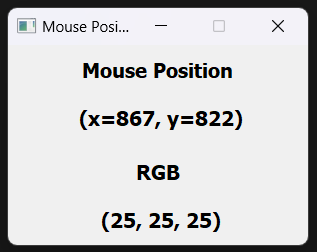

# Mouse Position

MousePosition is a simple Python script that displays the current position of the mouse and the RGB color codes of the pixel it is hovering over.

## Installation and Execution

1. Clone this repository to your computer:

   ```bash
   git clone https://github.com/ernakkc/mousePosition.git
   ```
2. Navigate to the project directory:
   
   ```bash
   cd mousePosition
   ```
3. Install the required dependencies using pip:

    ```bash
   pip install -r requirements.txt
   ```
4. Run python file:

    ```bash
   python mouse_position.py
   ```

## Example Screenshot


